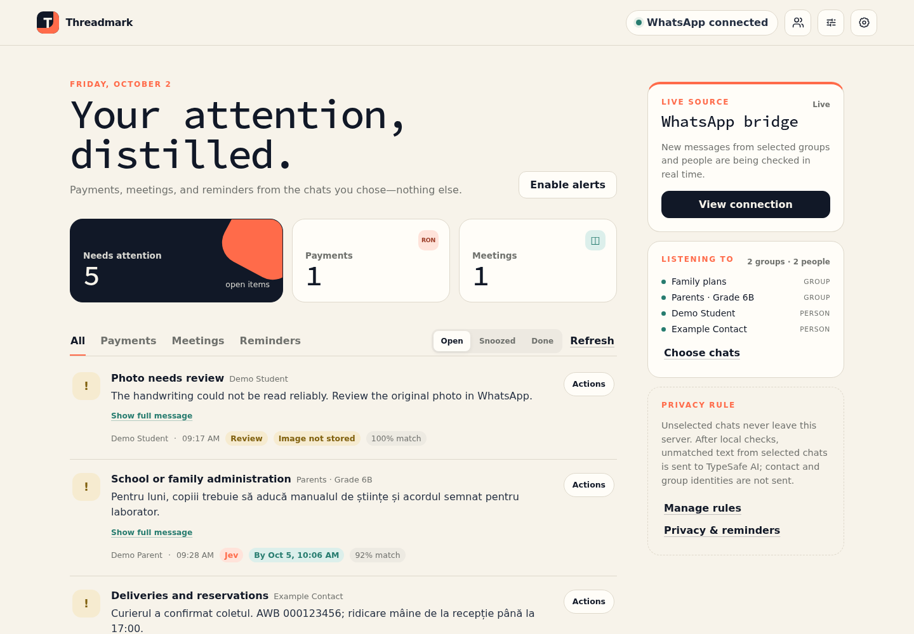
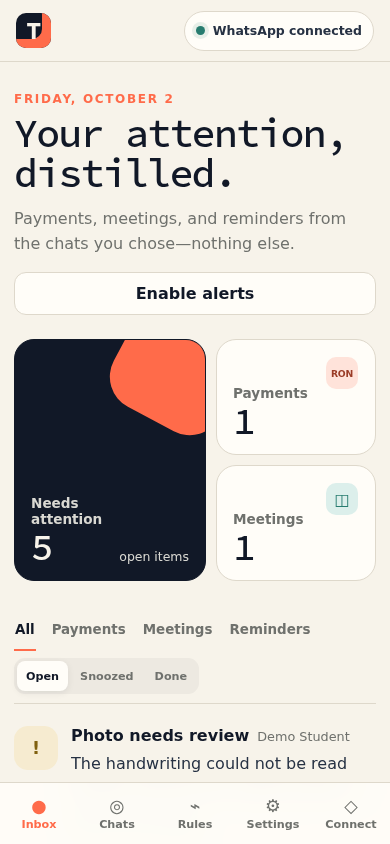
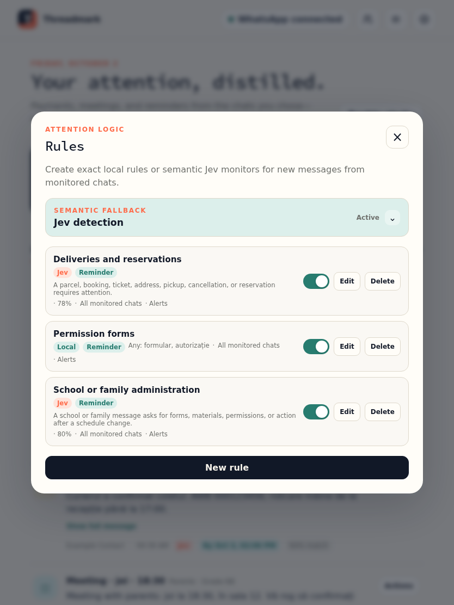
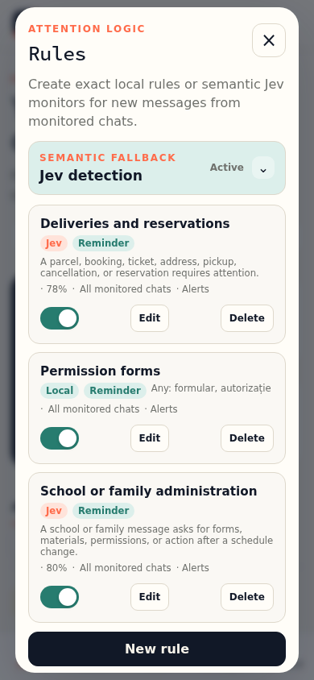

# Threadmark

Threadmark is a private, installable attention inbox for selected WhatsApp groups and individual contacts. A read-only linked-device bridge receives new messages, deterministic detectors and your own phrase rules identify items that matter, and the PWA shows only the resulting attention items.

> **Important:** the linked-device connector is unofficial. WhatsApp can change its protocol or restrict an account using an unofficial client. Threadmark deliberately does not send messages, mark messages as read, change presence or scrape history. Groups and people are disabled until you explicitly select them.

## Portfolio preview

The images below are captured from the real PWA using a temporary database and entirely synthetic chats. No personal WhatsApp data is used.

| Desktop inbox | Mobile inbox |
| --- | --- |
| [](docs/images/portfolio/threadmark-desktop-1440x1000.png) | [](docs/images/portfolio/threadmark-mobile-390x844.png) |

| Tablet rules | Mobile rules |
| --- | --- |
| [](docs/images/portfolio/threadmark-tablet-rules-834x1112.png) | [](docs/images/portfolio/threadmark-mobile-rules-390x844.png) |

## Documentation

- [User guide](docs/USER_GUIDE.md) — setup in the PWA, chat selection, rules, inbox actions, alerts and media.
- [Architecture](docs/ARCHITECTURE.md) — components, data flow, storage, detection pipeline and extension points.
- [Deployment and operations](docs/DEPLOYMENT.md) — direct Node, Podman Compose, Quadlet, upgrades, backups and troubleshooting.
- [Privacy and security](docs/PRIVACY.md) — local/external data boundaries, credentials, retention and risks.
- [API reference](docs/API.md) — browser, administrator and bridge endpoints.
- [Development guide](docs/DEVELOPMENT.md) — repository map, tests, detector work and synthetic screenshot generation.

## Architecture

- `threadmark-bridge`: Baileys linked-device client, QR/pairing-code control endpoint and persistent delivery outbox.
- `threadmark-app`: static PWA, invitation/device authentication, detectors, SQLite storage, live SSE feed and Web Push.
- `pwa-invite-console`: the existing external private console; Threadmark implements its standard admin API contract.
- `pwa-kit`: vendored service-worker update mechanism in `app/web/`.

The bridge and app run as separate rootless Podman containers on a private network. The bridge publishes no host port. Only the app binds to `127.0.0.1:4391`, for a local reverse proxy or Tailscale Serve.

## What works

- Single-use device invitations and revocable device sessions.
- Full `pwa-invite-console` device/invitation API contract.
- WhatsApp QR or phone-number pairing.
- Live receipt of new group and individual-chat messages.
- Separate group and contact allowlists; every source is off by default.
- Contact discovery from WhatsApp metadata and new incoming chats, without retaining unselected message content.
- Canonical phone-contact identity resolution for WhatsApp's private LID delivery addresses.
- Search for known groups and people, with phone-number lookup for contacts WhatsApp has not replayed to the linked device.
- Import selected contacts through the browser's privacy-preserving Contact Picker when the device supports it.
- Romanian and English payment and meeting detectors.
- Local custom rules with any/all phrase matching, category, chat scope, enable/disable controls, optional notifications and a sample-text tester.
- Optional Jev semantic fallback for locally unmatched payment, meeting and reminder messages, with visible probabilities and a configurable threshold.
- User-defined semantic monitors with plain-language conditions, per-monitor thresholds, chat scope, notifications and a Jev sample tester.
- Jev urgency probability stored as a priority signal; high-urgency items rise in the feed and receive a visible badge and urgent notification title.
- Local absolute/relative deadline extraction, due/overdue badges and downloadable calendar events.
- Snooze, daily digest, useful/not-relevant feedback and category correction controls.
- Optional context-aware correction/cancellation detection with a 48-hour local rolling buffer.
- Optional outgoing-message monitoring that closes reply reminders when you answer.
- Conservative payment warnings for changed details, changed amounts, possible duplicates and unusual credential/payment language.
- Optional local image/PDF OCR and multilingual voice-note transcription with Tesseract, Poppler and whisper.cpp inside the bridge container.
- Source excerpts, confidence, group or person, sender and detected details.
- Mark done/reopen data model and live updates through SSE.
- Optional Web Push notifications.
- Network-first PWA shell with automatic safe updates and `/bust` recovery.
- Rootless Podman Quadlet deployment and `podman compose` support.

## Local development

Node 24 or later is required.

```bash
npm --prefix app ci
npm --prefix bridge ci
npm test
```

Regenerate the synthetic portfolio screenshots without touching the production database:

```bash
npm run screenshots
```

The command starts a temporary local server, uses an in-process fake Jev adapter, writes the images and manifest under `docs/images/portfolio/`, then deletes the temporary database.

Create a temporary environment file outside Git:

```bash
THREADMARK_ENV_FILE="$PWD/deploy/threadmark.env" \
  node scripts/create-env.mjs https://threadmark.example
```

For a non-HTTPS localhost trial only, change `COOKIE_SECURE=0` in that temporary file. Then either run both processes directly or use Podman:

```bash
set -a
. deploy/threadmark.env
set +a
DATA_DIR="$PWD/data/app" HOST=127.0.0.1 node app/server/index.mjs
```

In another terminal:

```bash
set -a
. deploy/threadmark.env
set +a
DATA_DIR="$PWD/data/bridge" HOST=127.0.0.1 node bridge/index.mjs
```

Create the first device invitation through the private admin endpoint or after registering the app in `pwa-invite-console`:

```bash
curl -sS http://127.0.0.1:4391/api/admin/invites \
  -H "X-Admin-Token: $ADMIN_TOKEN" \
  -H 'Content-Type: application/json' \
  --data '{"label":"My phone"}'
```

Open the returned URL, activate the device, connect WhatsApp and select the groups or people to monitor.

## Podman Compose

After creating `deploy/threadmark.env`:

```bash
podman compose up --build -d
curl -fsS http://127.0.0.1:4391/api/health
```

Data lives under `./data` by default. Override `THREADMARK_DATA_DIR` and `THREADMARK_ENV_FILE` when needed.

## Production with Quadlet

Create the environment file in its production location:

```bash
node scripts/create-env.mjs https://your-threadmark-origin
```

Then run:

```bash
./deploy.sh
```

The deployment script:

1. installs pinned dependencies;
2. runs the tests;
3. builds both rootless Podman images;
4. installs the network and container Quadlets under `~/.config/containers/systemd/`;
5. starts the app, verifies health, then starts the bridge.

Expose the app over a private HTTPS origin. A dedicated Tailscale Serve port avoids service-worker scope conflicts with other PWAs:

```bash
tailscale serve --bg --https=8444 http://127.0.0.1:4391
```

Use that exact HTTPS origin as `PUBLIC_BASE_URL` when creating the environment file.

## Add to `pwa-invite-console`

The supplied installer reads the per-app `ADMIN_TOKEN`, inserts a tailnet-only Caddy route, adds the app definition and icon, validates Caddy, then reloads it:

```bash
sudo python3 scripts/install-console-route.py
```

Defaults:

- Caddyfile: `/etc/caddy/Caddyfile`
- console configuration: `/var/www/pwa-invite-console/apps.json`
- route prefix: `/threadmark/api/*`
- backend: `127.0.0.1:4391`

Override the paths and insertion anchor with `THREADMARK_CADDYFILE`, `THREADMARK_CONSOLE_APPS`, `THREADMARK_CONSOLE_ANCHOR` and `THREADMARK_ENV_FILE`.

The public/tailnet PWA route must never inject the admin token. Only the private invitation-console route should supply `X-Admin-Token`.

## Privacy and retention

- WhatsApp session credentials stay only in the bridge data volume.
- The app never receives raw encryption keys.
- New group and individual-chat events are routed only between the local bridge and app containers.
- Unselected message content is rejected before detection and long-term storage.
- Selected messages with no detection are not retained.
- Matched excerpts stay in the local SQLite database.
- Custom rule and semantic-monitor definitions stay in that same local database. Phrase test samples are evaluated locally and are not saved.
- When Jev is enabled, only the text of an otherwise-unmatched message from a selected chat is sent to TypeSafe AI. Threadmark does not send the chat name, sender name, phone number, WhatsApp ID or message ID.
- Context-aware changes/cancellations and reply monitoring are off by default. If enabled, selected-chat text and direction labels are held locally for at most 48 hours and recent text may be sent to Jev; identities and IDs are still removed.
- Outgoing messages are ignored unless reply monitoring is explicitly enabled.
- Attachment reading is off by default. If enabled, selected-chat media is downloaded and decrypted by the local bridge, processed inside the container, and deleted immediately. Only extracted text follows the same local/Jev routing rules as typed text.
- Jev test samples are sent to TypeSafe AI but are not saved by Threadmark. TypeSafe's own retention terms apply to all Jev requests.
- API and internal responses are never cached by the service worker.
- Message content is never intentionally written to logs.
- The default retention setting is 30 days; open attention items are preserved.

Back up both data directories together with the environment file, using encryption. Treat the bridge directory and `BRIDGE_TOKEN` as account credentials.

## Jev semantic detection

Threadmark always runs its deterministic detectors and local phrase rules first. If they find nothing and Jev is enabled, the app sends one request containing the message text, three independent built-in Noul questions (payment, meeting and reminder), an urgency Noul, and the applicable enabled semantic-monitor questions. Multiple questions are batched in that request. A matching custom monitor takes precedence over the generic fallback and uses its own threshold; otherwise the strongest built-in result becomes an attention item when it reaches `JEV_THRESHOLD` (default `0.78`). The urgency probability is stored separately as the item's priority; values at or above `0.78` are surfaced as urgent. API failure is fail-open: WhatsApp ingestion continues and local detection remains available.

Urgency and deadline enrichment do not expand the default privacy boundary: messages handled entirely by local detectors or phrase rules are not sent to Jev solely to obtain those signals. Enabling context-aware or reply monitoring explicitly expands the Jev input to recent selected-chat text as described in the PWA.

Configure the API key without placing it in shell history or the browser:

```bash
node scripts/configure-jev.mjs
systemctl --user restart threadmark-app.service
```

The script uses `systemd-ask-password`, stores the key only in the mode-`0600` Threadmark environment file and never prints it. To stop sending selected message text to TypeSafe while retaining the key:

```bash
node scripts/configure-jev.mjs --disable
systemctl --user restart threadmark-app.service
```

## Extending detectors

Detectors live in `app/server/detectors.mjs` and return a stable attention-item shape. Add new detector modules behind the same contract rather than changing the bridge. Connector events remain normalized to:

```js
{
  id, sourceId, sourceName, sourceKind, senderId, senderName, sentAt, text, direction, media
}
```

This keeps later Telegram, email or official WhatsApp Business connectors independent from the PWA and storage layer.

For personal matching needs, no code change is required: open **Rules** in the PWA and choose either **Phrase rule · local** or **Semantic monitor · Jev**. Phrase rules match any/all terms case- and accent-insensitively inside the local app container. Semantic monitors express a narrow condition in ordinary language and have an adjustable probability threshold. Both can be restricted to selected chats and apply only to new messages.

## License

Threadmark is free software licensed under the [GNU General Public License v3.0 only](LICENSE), SPDX identifier `GPL-3.0-only`. This matches the license of the vendored `pwa-kit` update mechanism.
